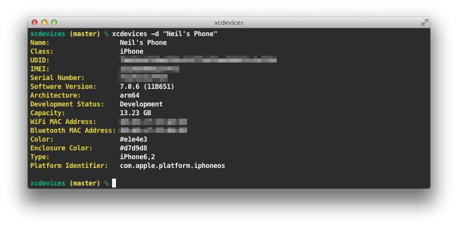
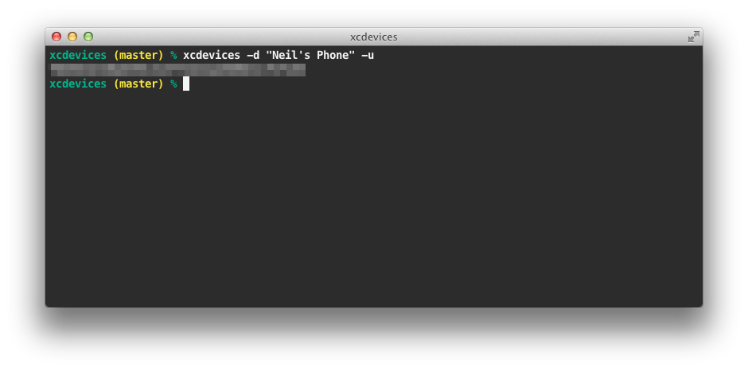
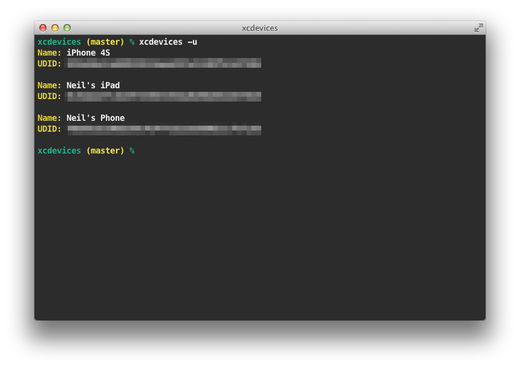

# xcdevices

__xcdevices__ is a Mac command-line utility for display information about iOS devices registered with Xcode. All without having the device plugged in. 

The detailed information includes the following:

    Device Name
    Device Class
    UDID
    IMEI
    Serial Number
    Software Version
    CPU Architecture
    Development Status
    Storage Capacity
    WiFi MAC Address
    Bluetooth MAC Address
    Color
    Enclosure Color
    Hardware Type
    Platform Identifier

### Usage

##### 1. Detailed information about all registered devices:

Run `xcdevices` with no parameters.

##### 2. Detailed information about a specific device:

Run `xcdevices -d <device name>` 

##### 3. UDID of a specific device:

Run `xcdevices -u -d <device name>` 

##### 4. UDID of all registered devices:

Run `xcdevices -u` 

> __Handy Hint:__ Copy the UDID of a specific device to the clipboarding using `xcdevices -i -d <device name> | pbcopy`. 

### Installing

#### Manually

1. Install [__Go__](http://golang.org).
2. Compile by running `go build xcdevices.go`.
3. Copy the `xcdevices` binary to a folder in your `PATH`.

#### Homebrew

```
brew tap neilco/formulae
brew install xcdevices
```

### Contact

[Neil Cowburn](http://github.com/neilco)
[@neilco](https://twitter.com/neilco)

## License

[MIT license](http://neil.mit-license.org)

Copyright (c) 2014 Neil Cowburn (http://github.com/neilco/)

MIT License

Permission is hereby granted, free of charge, to any person obtaining
a copy of this software and associated documentation files (the
"Software"), to deal in the Software without restriction, including
without limitation the rights to use, copy, modify, merge, publish,
distribute, sublicense, and/or sell copies of the Software, and to
permit persons to whom the Software is furnished to do so, subject to
the following conditions:

The above copyright notice and this permission notice shall be
included in all copies or substantial portions of the Software.

THE SOFTWARE IS PROVIDED "AS IS", WITHOUT WARRANTY OF ANY KIND,
EXPRESS OR IMPLIED, INCLUDING BUT NOT LIMITED TO THE WARRANTIES OF
MERCHANTABILITY, FITNESS FOR A PARTICULAR PURPOSE AND
NONINFRINGEMENT. IN NO EVENT SHALL THE AUTHORS OR COPYRIGHT HOLDERS BE
LIABLE FOR ANY CLAIM, DAMAGES OR OTHER LIABILITY, WHETHER IN AN ACTION
OF CONTRACT, TORT OR OTHERWISE, ARISING FROM, OUT OF OR IN CONNECTION
WITH THE SOFTWARE OR THE USE OR OTHER DEALINGS IN THE SOFTWARE.
